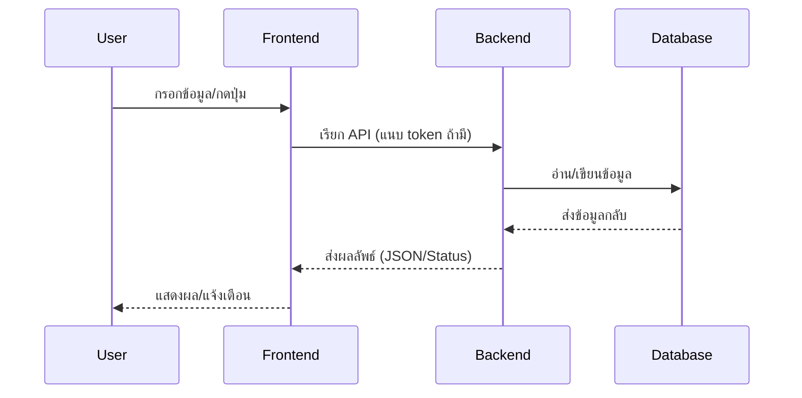

# System Flow (โฟลว์หลักของระบบ)

## ภาพรวม Sequence Diagram

## 1. User Login
- User กรอกข้อมูลเข้าสู่ระบบ (email/student_id + password)
- Frontend ส่งข้อมูลไป backend (`/api/auth/login`)
- Backend ตรวจสอบข้อมูล → ถ้าถูกต้อง ส่ง JWT token กลับ
- Frontend เก็บ token ไว้ใน localStorage/session

## 2. ดูข้อมูล (ตัวอย่าง: ดูรายการอุปกรณ์)
- User กดดูข้อมูลในหน้าเว็บ
- Frontend เรียก API (`/api/equipment`) พร้อมแนบ token (ถ้าต้องยืนยันตัวตน)
- Backend ตรวจสอบ token (ถ้าต้องใช้) → ดึงข้อมูลจาก DB
- Backend ส่งข้อมูลกลับมา (JSON)
- Frontend แสดงผลข้อมูลบน UI

## 3. การยืมอุปกรณ์
- User กรอกฟอร์มยืมของในหน้าเว็บ
- Frontend ส่งข้อมูลไป backend (`/api/borrow/request`) พร้อม token
- Backend ตรวจสอบ token + เงื่อนไข (จำนวน, วัน, สถานะ ฯลฯ)
- ถ้าผ่าน → backend บันทึกข้อมูลลง DB (status = PENDING)
- Backend ส่งผลลัพธ์กลับ (success/error)

## 4. การอนุมัติ/ปฏิเสธ (admin)
- Admin กดอนุมัติ/ปฏิเสธคำขอยืมในหน้าเว็บ
- Frontend เรียก API (`/api/borrow/approve/:id` หรือ `/api/borrow/reject/:id`) พร้อม token
- Backend ตรวจสอบ token + role + เงื่อนไขสถานะ
- Backend อัปเดตสถานะใน DB
- Backend ส่งผลลัพธ์กลับ

## 5. การคืนอุปกรณ์
- User กดคืนอุปกรณ์ในหน้าเว็บ
- Frontend เรียก API (`/api/borrow/return/:id`) พร้อม token
- Backend ตรวจสอบ token + เงื่อนไข
- Backend อัปเดตสถานะใน DB (status = RETURN_PENDING)
- Backend ส่งผลลัพธ์กลับ

- Admin กดยืนยันการคืน (`/api/borrow/confirm-return/:id`)
- Backend ตรวจสอบ token + role + เงื่อนไข
- Backend อัปเดตสถานะใน DB (status = RETURNED)
- Backend ส่งผลลัพธ์กลับ

---

## Edge Cases & สถานะผิดปกติ

- **ยืมเกินจำนวน:**
	- Backend ปฏิเสธ (error: จำนวนเกินที่เหลือ/อนุญาต)
	- Frontend แจ้งเตือนทันที
- **คืนช้า:**
	- ระบบแจ้งเตือน (reminder) อัตโนมัติ (ถ้ามี)
	- สถานะ borrow อาจถูก flag ว่า overdue
- **สถานะผิดปกติ:**
	- เช่น พยายามคืนของที่ไม่ได้อยู่ในสถานะ APPROVED → Backend ปฏิเสธ
	- พยายามอนุมัติ/ปฏิเสธ request ที่ไม่ใช่ PENDING → Backend ปฏิเสธ

---

## Flow เสริม (ฟีเจอร์รอง)

### 6. ระบบแจ้งเตือน (Reminder)
- Backend ตรวจสอบ borrow ที่ใกล้ครบกำหนด/เกินกำหนด
- ส่ง reminder (เช่น notification) ถึง user
- Frontend แสดง reminder ใน dashboard

---

> หมายเหตุ: ทุก flow สำคัญจะมีการตรวจสอบ token และ role ที่ backend เสมอ
> ข้อมูลทุกอย่างในระบบจะ sync ผ่าน API เท่านั้น (frontend ไม่แก้ไข DB ตรง)
